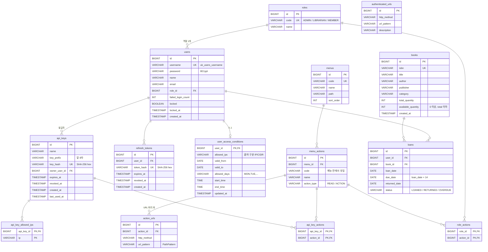

# ERD

스키마 원본은 [`library-backend/src/main/resources/schema.sql`](../library-backend/src/main/resources/schema.sql) 이다.
JPA `ddl-auto` 는 `validate` 로 두어 엔티티 매핑과 스키마가 어긋나면 기동이 실패한다.

## 메모

- `menu_actions.code` 는 메뉴 안에서만 유일하다. 전역 식별자는 `메뉴코드:액션코드`(예: `BOOK_MANAGE:CREATE`)다.
- `action_urls` 는 `(action_id, http_method, url_pattern)` 가 유일하다. 같은 (메서드, 패턴)이 여러 액션에 있을 수 있고, 판정은 OR 이다.
- `user_access_conditions.allowed_ips` 는 명세상 TEXT 지만 H2(PostgreSQL 모드)와 PostgreSQL 양쪽에서 같은 타입으로 매핑되도록 `VARCHAR(2000)` 으로 두었다.
- `public_urls` 테이블은 두지 않는다. permitAll 목록은 코드(`PublicEndpoints`) 한 곳에서만 관리한다.
